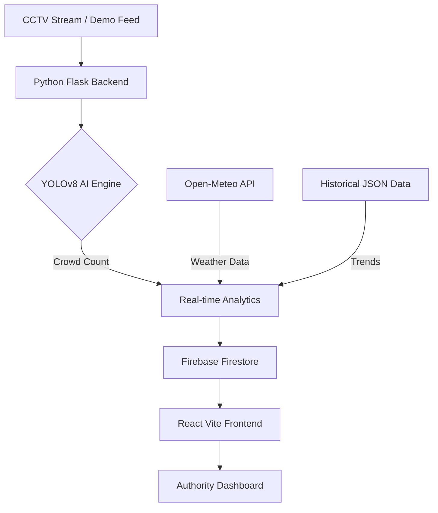

# 🏔️ Pilgriment: AI-Powered Smart Pilgrimage Crowd Management

[](https://opensource.org/licenses/MIT)
[](https://reactjs.org/)
[](https://vitejs.dev/)
[](https://tailwindcss.com/)
[](https://www.python.org/)
[](https://ultralytics.com/)

**Pilgriment** is a state-of-the-art, AI-driven crowd management system engineered to safeguard the millions of pilgrims embarking on the **Char Dham Yatra**. By merging Computer Vision, Predictive Analytics, and Real-time Weather Intelligence, Pilgriment transforms chaotic crowd data into actionable safety insights.

---

## ✨ Premium Features

### 👁️ Intelligent Crowd Monitoring
*   **Real-time YOLOv8 Vision**: Edge-processed CCTV analysis that detects and counts pilgrims with precision.
*   **Density Mapping**: Visualizes "hot zones" to prevent dangerous bottlenecking at temple entrances.

### 🔮 Predictive Analytics & Forecasting
*   **Multi-Factor Blending**: Our proprietary engine combines historical yatra trends, current flow rates, and **Open-Meteo API** weather data.
*   **Proactive Alerts**: Predicts overcrowding *before* it happens, allowing authorities to manage flow at base camps like Sonprayag.

### 🛡️ Secure Digital Ecosystem
*   **Immutable Ticketing**: Firebase-backed secure ticket generation to prevent fraud and ensure data integrity.
*   **Dynamic Dashboard**: A premium, high-performance React frontend featuring glassmorphism design and smooth Framer Motion animations.

---

## 🏗️ Technical Architecture



---

## 🛠️ Installation & Setup

### 1. Prerequisites
*   Node.js (v18+)
*   Python (v3.9+)
*   Firebase Project (Firestore & Auth enabled)

### 2. Repository Setup
```bash
git clone https://github.com/Sampat-Barik/PILGRIMENT.git
cd PILGRIMENT
```

### 3. Environment Configuration
Create a `.env` file in the root directory:
```env
VITE_FIREBASE_API_KEY=your_key
VITE_FIREBASE_AUTH_DOMAIN=your_domain
VITE_FIREBASE_PROJECT_ID=your_id
VITE_FIREBASE_STORAGE_BUCKET=your_bucket
VITE_FIREBASE_MESSAGING_SENDER_ID=your_id
VITE_FIREBASE_APP_ID=your_app_id
VITE_FIREBASE_MEASUREMENT_ID=your_id
VITE_API_BASE=http://localhost:5000
VITE_GEMINI_API_KEY=your_gemini_key
VITE_TAVILY_API_KEY=your_tavily_key
```

### 4. Running the Project
**Frontend:**
```bash
npm install
npm run dev
```

**Backend:**
```bash
cd backend
pip install -r requirements.txt
python server.py
```

---

## 🔒 Security Note
This repository uses environment variables for all sensitive configuration. Sample data and fallback mechanisms are provided for demonstration, but a live Firebase instance is required for full functionality.

---

## 👥 Contributors
*   **Sampat Barik** - Technical Lead & System Architect
*   **Sayan Maity** - Project Lead & Strategy

---

## 📜 License
This project is licensed under the **MIT License** - see the [LICENSE](LICENSE) file for details.

*Developed with ❤️ for the safety of pilgrims worldwide.*
